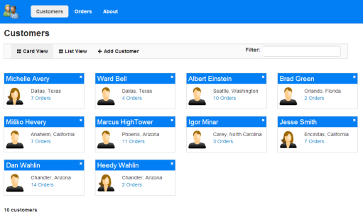
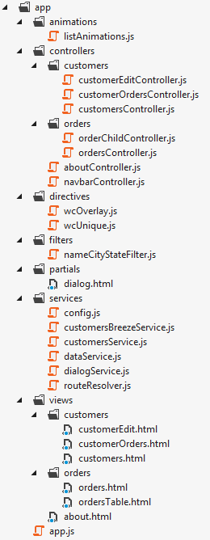

Customer Manager with AngularJS (with custom routing and dynamic controller script loading)
===============

If you’re new to AngularJS check out my [AngularJS in 60-ish Minutes](http://weblogs.asp.net/dwahlin/archive/2013/04/12/video-tutorial-angularjs-fundamentals-in-60-ish-minutes.aspx) video tutorial or download the [free eBook](http://weblogs.asp.net/dwahlin/archive/2013/07/30/angularjs-in-60-ish-minutes-the-ebook.aspx). Also check out [The AngularJS Magazine](http://flip.it/bdyUX) for up-to-date information on using AngularJS to build Single Page Applications (SPAs).

Also check out my <a href="http://tinyurl.com/angularjsjumpstart">AngularJS JumpStart</a> video course:

This version of the application has support for custom routing and dynamic controller script loading. See this [this post](http://weblogs.asp.net/dwahlin/archive/2013/05/22/dynamically-loading-controllers-and-views-with-angularjs-and-requirejs.aspx) for more details. The standard version of the application with no custom routing can be [found here](https://github.com/DanWahlin/CustomerManagerStandard).

This application demonstrates:

* A complete application with read-only and editable data
* Using AngularJS with $http in a factory to access a backend RESTful service
* Using BreezeJS in a factory to access a backend RESTful Service
* Techniques for showing multiple views of data (card view and list view)
* Custom filters for filtering customer and product data
* A custom directive to ensure unique values in a form for email 
* A custom directive that intercepts $http and jQuery XHR requests (in case either are used) and displays a loading dialog
* A custom directive that handles highlighting menu items automatically based upon the path navigated to by the user
* Form validation using AngularJS
* Provides login and authentication functionality (currently client-side only - plan to add server-side part too which is absolutely required in a "real" app)
* A custom routing mechanism that allows a controller & template to be downloaded dynamically "on the fly" and provides a standard convention for controller and view names (see [this post](http://weblogs.asp.net/dwahlin/archive/2013/05/22/dynamically-loading-controllers-and-views-with-angularjs-and-requirejs.aspx)
 for more details)

The factories can be switched by changing the app/customersApp/services/config useBreeze setting to true.

The AngularJS portion of the app is structured using the following folders:

## Requirements:

###If you're using Visual Studio and .NET:

The following is required to support the backend services:

* Visual Studio 2012 Web Express (free version) or higher - http://www.microsoft.com/visualstudio/eng/products/visual-studio-express-products#product-express-summary

* ASP.NET MVC and Web API are used for the back-end services along with Entity Framework for database access (included if you have VS 2012 express installed)

To get started, double-click the CustomerManager.sln file located at the root of the CustomerManager repository. Once the solution loads press F5 to run the project.

###If you're using Node.js/Express/MongoDB

If you don't already have Node.js on your machine install it from http://nodejs.org. You'll also need to install MongoDB from http://www.mongodb.org if you don't have it already and get it configured and running using the instructions on their site.

In the CustomerManager directory execute 'npm install' to install Express, MongoDB and Mongoose (package.json).

Load MongoDB Sample Data Option 1: 

Load data into MongoDB by performing the following steps:

* Execute 'mongod' to start the MongoDB daemon
* Navigate to the CustomerManager/server directory (the one that has initMongoData.js in it)
* Execute 'mongo' to start the MongoDB shell
* Enter the following in the mongo shell to load the data seed file:
 * use customermanager
 * load("initMongoData.js")

Load Sample Data Option 2: 

Alternatively you can navigate to CustomerManager/server and double-click the initMongoData.bat (Windows) or initMongoData.sh (Mac/Linux) file to initialize MongoDB with the data. 

The Windows script assumes that MongoDB is installed at c:\mongodb while the Linux/Mac script relies on the fact that you have the monogo executable
in the path.

Start the Node/Express server:

* Open a command prompt
* Navigate to the CustomerManager directory
* Run 'npm install' at the command prompt
* Navigate to the CustomerManager/server directory
* Run 'node server.js'

View the application at http://localhost:3000

Thanks to [Tony Quinn](https://github.com/tonyq) for contributing the initial Node.js/MongoDB code!

